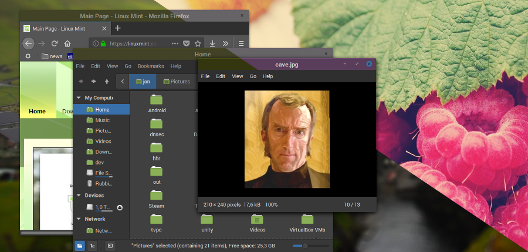

### A simple hack to adjust WM theme colours automatically when a new desktop image loads.
#### Tested on GTK/Cinnamon.



#### Install
1. You need to make a copy of the theme you are going to use into your ~/.theme folder.
2. The theme needs to have the metacity-1 folder with a metacity-theme-3.xml file

When run for the first time the script creates a backup of the metacity-theme-3.xml as metacity-theme-3.xml_
The script then modifies the XML and overwrites the metacity-theme-3.xml file.

You will see that the program crashes, the first time it is run. You will have to modify the metacity-theme-3.xml_
file a little bit. There is a dubious XML that neither Python XML accepts:

```XML
<draw_ops name="title_focused">
    <title version="< 3.1"
        x="(0 `max` ((width - title_width) / 2))"
        y="(0 `max` ((height - title_height) /2)) + 1"
        color="C_title_focused_highlight" />
    <title version="< 3.1"
        x="(0 `max` ((width - title_width) / 2))"
        y="(0 `max` ((height - title_height) /2))"
        color="C_title_focused" />
    <title version=">= 3.1"
        x="(0 `max` ((frame_x_center - title_width / 2) `min` (width - title_width)))"
        y="(0 `max` ((height - title_height) /2)) + 1"
        ellipsize_width="width"
        color="C_title_focused_highlight" />
    <title version=">= 3.1"
        x="(0 `max` ((frame_x_center - title_width / 2) `min` (width - title_width)))"
        y="(0 `max` ((height - title_height) /2))"
        ellipsize_width="width"
        color="C_title_focused" />
</draw_ops>
```

Python XML parsers doesn't like the `"< 3.1"` or `">= 3.1"` attributes. Change them to `"&lt; 3.1"` and `"&gt;= 3.1"`, respectevly.
I don't know if this is a sloppy XML or Python XML libraries bug, and can't be bothered to figure it out. :smiley:

#### Todo
* Check for light themes, should be simple, titlebar/titlebar text colors comparision.
* Better error handling, sometimes the color algorithm crashes and leaves everything hanging, becuase I'm waiting for the next output from gsettings.


I borrowed the algorithm script from , I hope he doesn't mind

Run: `python3 setcolor.py`
